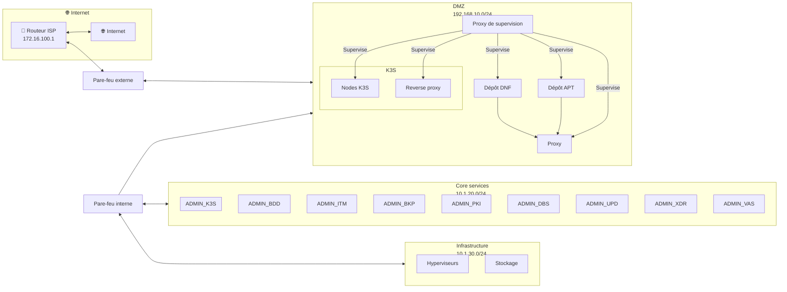

# Mise en place de l'infrastructure
## Descriptif
Ce chapitre décrit l'installation, l'exploitation et la résolution de pannes associées à l'infrastructure d'hébergement du projet [Infr@home](../README.md). C'est un composant particulier, car l'hébergement du projet peut être effectué sur n'importe quelle plateforme de virtualisation, propriétaire ou libre, permanente ou temporaire.

Ce chapitre présente l'installation et la configuration des hyperviseurs, basés sur [Proxmox VE](https://www.proxmox.com/en/products/proxmox-virtual-environment/overview) et sur un stockage basé sur des [NAS](https://fr.wikipedia.org/wiki/Serveur_de_stockage_en_r%C3%A9seau) Synology.

## Matériel retenu et exploité
Le projet initial étant produit non pas en entreprise, mais en hébergement à domicile, le matériel est retenu pour ses performances, sa consommation énergétique, son coût et son encombrement.

### Hyperviseurs
Les hyperviseurs devront héberger les machines virtuelles, et doivent par conséquent disposer de processeurs performants et de grandes quantités de mémoire vive.

Le premier hyperviseur est un Intel NUC NUC11TNKv7 disposant d'un processeur [Intel Core i7-1185G7](https://www.intel.fr/content/www/fr/fr/products/sku/208664/intel-core-i71185g7-processor-12m-cache-up-to-4-80-ghz-with-ipu/specifications.html), de 64Go de mémoire vive et de 120Go de stockage local en SSD.

Les hyperviseurs prendront en charge la totalité de la [charge CPU](https://fr.wikipedia.org/wiki/Processeur) et de la charge RAM. L'ajout d'un hyperviseur dans le cluster restera une opération de routine simple.

> [!IMPORTANT]
> Pour un déploiement en environnement professionnel, de véritables serveurs sont requis, ceci afin de disposer du contrôle ECC de la mémoire vive, de la tolérance de panne électrique/réseau, de plusieurs cartes réseau dédiées...

> [!TIP]
> Dès la conception de l'infrastructure, il faut envisager sa tolérance aux pannes.
> Dans un premier temps, chaque serveur devrait disposer de deux alimentations, dont au moins une reliée à un onduleur. Les deux alimentations ne doivent **jamais** être sur un même onduleur, et les onduleurs ne doivent **jamais** être reliés en série.
> Les serveurs doivent également disposer d'au moins un double-attachement réseau pour **chaque connexion logique**, reliées à deux commutateurs réseau différents.
> La charge des serveurs doit permettre une tolérance de panne des serveurs, soit permettant de prioriser des machines virtuelles, soit permettant de basculer toutes les ressources en cas de défaillance d'un ou plusieurs serveurs.

### Stockage
Le stockage est réalisé par deux NAS [Synology DS220+](https://www.synology.com/fr-fr/products/DS220+) hébergeant chacun deux disques de 4To en RAID1 (ce qui offre 4To de stockage utile par NAS et une tolérance de perte d'un disque dur).

Ces NAS présenteront des chemins [iSCSI](https://fr.wikipedia.org/wiki/ISCSI). Une carte réseau sera dédiée à la tolérance de panne entre les NAS, ne laissant qu'une carte réseau à la fois pour la gestion du NAS et pour le protocole iSCSI.

> [!IMPORTANT]
> Pour un déploiement en environnement professionnel, chaque NAS devrait disposer d'au moins 5 cartes réseau pour mettre en oeuvre cette configuration: un aggrégat de deux cartes reliées à deux commutateurs différents permettant la gestion du NAS, un aggrégat de deux cartes réseau reliées à deux commutateurs différents permettant la présentation des LUN en iSCSI et une carte d'un débit supérieur (par exemple 10Gb/s) pour la mise en oeuvre de la tolérance de panne, en connexion directe entre les NAS.

> [!TIP]
> Dans la mesure du possible, une réplication des NAS sera mise en oeuvre vers un site distant.
> Synology propose des baies de disques professionnelles avec les mêmes paquets et la même configuration que ceux proposés dans ce document.

Une topologie réseau est présentée ci-dessous:

## Installations et configurations
### Proxmox VE

> [!TIP]
> Cette partie sera réalisée ultérieurement.

### NAS Synology DS220+

Pour revenir à la page d'accueil du projet, [cliquez ici](../README.md).